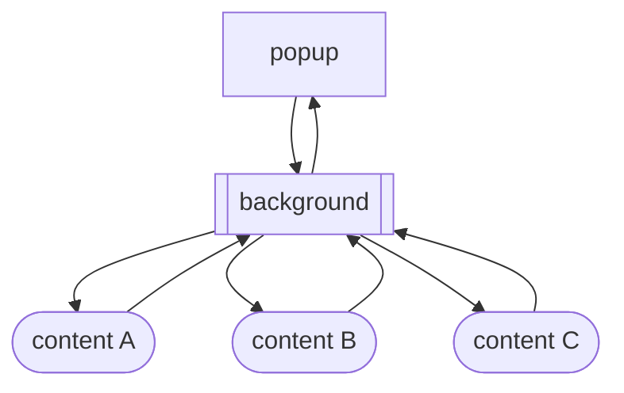
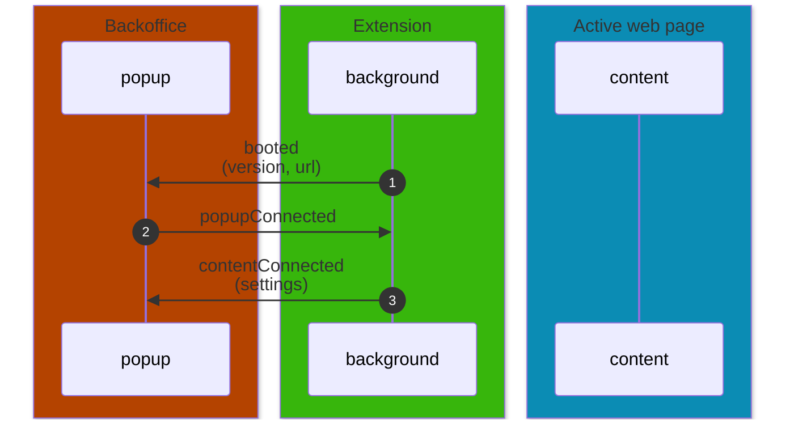
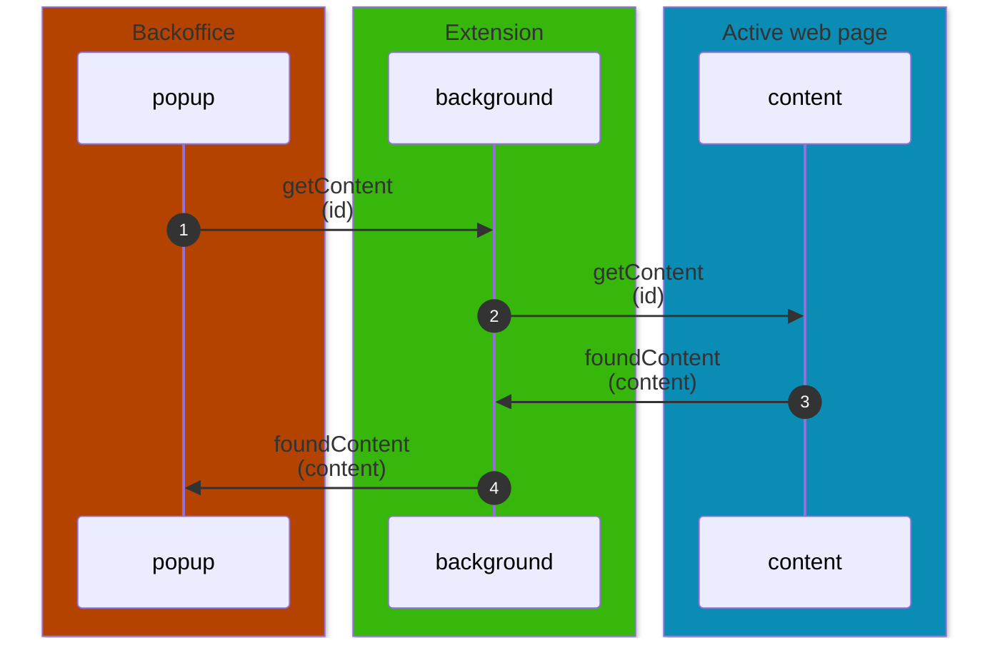
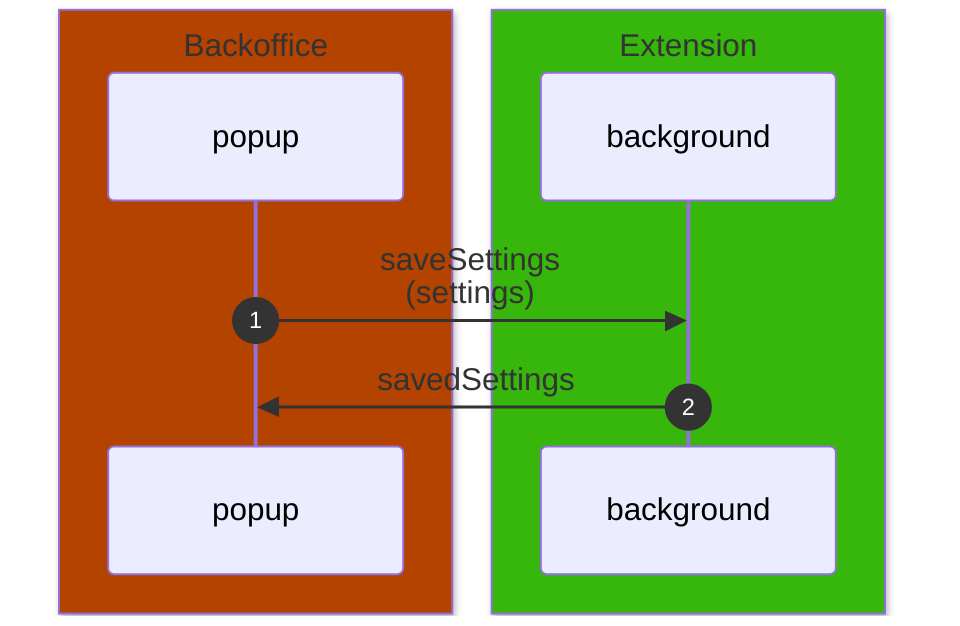
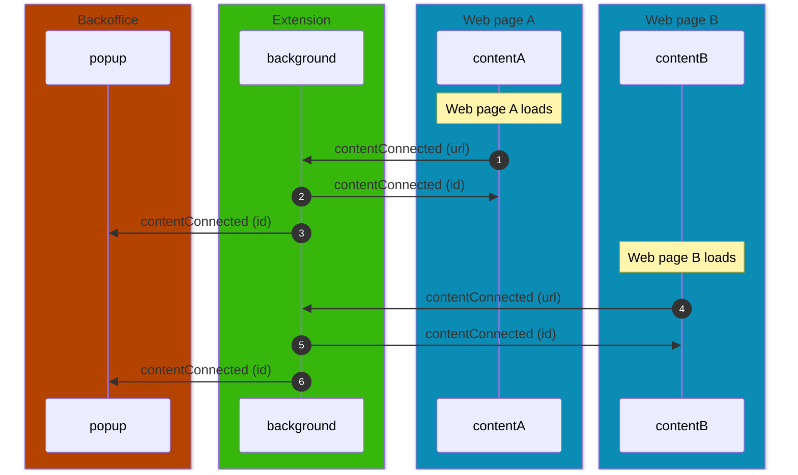

# Chrome Extension

## Installation

Run the following scripts to get the dev environment up and running:

```bash
yarn
```

### Local development

```bash
yarn serve
```

### Create build

Build all:

```bash
yarn build:all
```

Build all and zip the builds:

```bash
yarn build:zip
```

Build all for specific environment:

```bash
yarn build --environment testing
yarn build --environment production
```

Build only `myparcel` for specific environment:

```bash
yarn build myparcel --environment testing
yarn build myparcel --environment production
```

### Load extension

In your Chromium browser, go to `chrome://extensions` and turn on developer mode if you haven't already. Press the "Load unpacked" button in the top left and select the folder of the extension you want from `dist`. To load the HMR extension (`yarn serve`), select the entire `dist` folder.

You need to run the backoffice locally as well and change the `browserExtensionId` in the dev config for the platform you're trying to use to the id of the extension you just added. You can find this id in `chrome://extensions`.

That's it, now you can use the extension by pressing the new button in your toolbar!

## Usage

### How it works

The extension has an always-present script which is the background script (service worker). It will inject a content script on every web page you visit. The third script is actually part of the Backoffice but will be referred to as "popup" or "popup script".

#### Flow

The extension works by sending messages between the three scripts. The background can communicate with both the content and the popup, but the content and popup can't communicate with each other, meaning any message has to pass through the background script.

There can be any amount of content scripts, but there will always be only one background and one popup.



#### Popup

When you open the extension (via the browser button) it will load the backoffice in a popup. The backoffice URL is based on the current environment and platform. If you use the sendmyparcel extension made with `yarn serve` the initial popup URL will be `extension.dev.sendmyparcel.be/browser-extension/create-shipment`.

The backoffice will be in a different "mode", most routes are not loaded. On loading the backoffice it will "boot" the browser extension and send a `popupConnected` message to the background script.

### Debugging

To debug the extension, go to `chrome://extensions` in Chrome and click the `service worker` link for this extension. This will open a console window for the extension's background script. In development and testing environments there will be a fair amount of logging to show the user what's happening and allow for easier debugging. All logger code is stripped away in the production environment.

## Flows

Here are some flows that the extension can go through.

### User opens popup

When the user clicks the extension button, the background script opens a popup with the backoffice, and sends a message to the popup script with the version of the extension and active tab URL. The popup script will then send a message back to the background script to confirm it's connected.



> When the popup receives the `contentConnected` message, it will start [the flow to get the content of the web page](#get-content-of-active-web-page).

### Get content of active web page

This flow is triggered after the popup receives the `contentConnected` message. This can occur from the new shipment page as well as the custom mapping page in the popup.



The received content will be used to fill the shipment screen in the backoffice.

### User saves settings in popup



### Web pages load

As any amount of web pages can be open at the same time, the extension will have to keep track of all of them. This is done by keeping the tab id of the web page in the background script. Content pages don't know about each other.



> When the popup receives the `contentConnected` message, it will start [the flow to get the content of the web page](#get-content-of-active-web-page).
